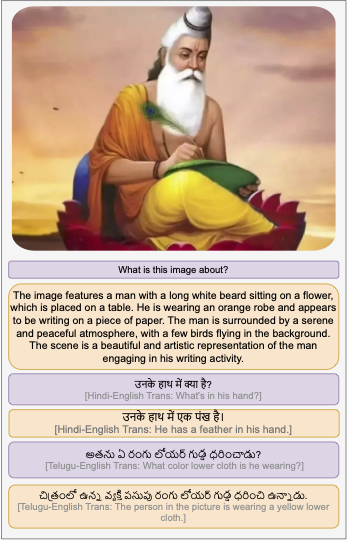
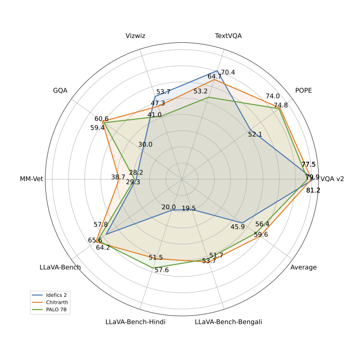

# Chitrarth: Bridging Vision and Language for a Billion People

## 1. Introduction

Chitrarth (Chitra: Image; Artha: Meaning) is a multilingual VLM that integrates a state-of-the-art multilingual Large Language Model (LLM) with a vision module. This model is trained primarily on multilingual image-text data and is designed to work across 10 prominent Indian languages, including Hindi, Bengali, Telugu, Tamil, Marathi, Gujarati, Kannada, Malayalam, Odia, and Assamese, as well as English



## 2. Model Summary

### Key Features
- **Model:** Krutrim-1 as the base LLM, SigLIP as the visual encoder with 2 layer MLP
- **Languages Supported:** 10 Indic languages - Hindi, Bengali, Telugu, Tamil, Marathi, Gujarati, Kannada, Malayalam, Odia, and Assamese, as well as English
- **Usage:** General purpose VLM


## 3. API Platform
Visit [Chitrarth Online](https://cloud.olakrutrim.com/console/inference-service?section=models&modelName=Krutrim&artifactName=chitrarth&artifactType=model) to access the model via the web interface. 


## 4. Inference code


```
```

## 5. Evaluation Results




Performance against SOTA VLMs on different academic multimodal tasks. Our model consistently outperforms IDEFICS 2 (7B) and PALO 7B on different benchmarks while remaining competitive on TextVQA and Vizwiz.

We introduce **BharatBench**, a comprehensive evaluation benchmark suite designed for **10 under-resourced Indic languages** across **3 tasks**. The performance of **Chitrarth** on the BharatBench Evaluation framework sets a strong baseline for future research in this domain. Our model is unique in its ability to handle all included languages.

Below are the performance results of **Chitrarth** on BharatBench across three evaluation tasks: **POPE**, **LLaVA-Bench**, and **MMVet**.

| **Language**   | **POPE** | **LLaVA-Bench** | **MMVet** |
|----------------|----------|-----------------|-----------|
| **Telugu**     | 79.9     | 54.8            | 43.76     |
| **Hindi**      | 78.68    | 51.5            | 38.85     |
| **Bengali**    | 83.24    | 53.7            | 33.24     |
| **Malayalam**  | 85.29    | 55.5            | 25.36     |
| **Kannada**    | 85.52    | 58.1            | 46.19     |
| **Assamese**   | 55.59    | 59.1            | 37.29     |
| **Tamil**      | 83.28    | 58.3            | 34.31     |
| **Marathi**    | 79.17    | 52.8            | 40.96     |
| **Gujarati**   | 84.75    | 55.9            | 39.03     |
| **Odia**       | 82.03    | 62.8            | 19.67     |
| **English**    | 87.63    | 67.9            | 30.49     |

## 6. CLI Inference

```
# Clone the Repository
git clone https://github.com/ola-krutrim/Chitrarth.git
conda create --name chitrarth python=3.10
conda activate chitrarth
cd Chitrarth 
pip install -e .
python chitrarth/inference.py --model-path "krutrim-ai-labs/chitrarth" --image-file "assets/govt_school.jpeg" --query "Explain the image. "
```
## 7. License

## 8. Citation

```
@inproceedings{
  khan2024chitrarth,
  title={Chitrarth: Bridging Vision and Language for a Billion People},
  author={Shaharukh Khan, Ayush Tarun, Abhinav Ravi, Ali Faraz, Praveen Kumar Pokala, Anagha Bhangare, Raja Kolla, Chandra Khatri, Shubham Agarwal},
  booktitle={NeurIPS Multimodal Algorithmic Reasoning},
  year={2024},
}
```

## 9. Contact
Contributions are welcome! If you have any improvements or suggestions, feel free to submit a pull request on GitHub.