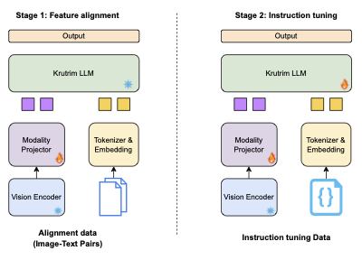

# Chitrarth: Bridging Vision and Language for a Billion People
[](https://huggingface.co/krutrim-ai-labs/chitrarth)	[](https://github.com/ola-krutrim/Chitrarth)	[![Static Badge](https://img.shields.io/badge/Krutrim_Cloud-Chitrarth-orange?logo=data:image/png%2bxml;base64,iVBORw0KGgoAAAANSUhEUgAAACAAAAAgCAYAAABzenr0AAADpUlEQVRYCbVXTUhbQRDeRJqi2JSS1BQtgpCa0kiPehdNi6dWbfWgF0s9eGtPFSFG8VDMpSiCB28KQou0NwsS9NA/Dx4qNP1TUIqSmlKSFjQx4vabbXbJz8vLe2kz8GX3zc7MN2/2J/sszLichekN4A7gBZxpcLQ/0gijfQq8BFLAf5ELiBIEfgNEZgSxtA/5liw2eD4EfgJGSLVsyPcBQLFMiR3WIUAraCm6F4hFMQ2JB1afgFKI9Hw+IubVYhnQwvpSBnKZ2GfEvlgoiTMYeFNGcpnEK3AQV548gkYalbslLiGWdEtl2QbOpZ9FMzg4yGprazNVpvrr6+tseXlZy+cXlFeAAzk4i07eW29sbPB/kampqbyYGTzEyagC5wHKJG+v6lWgqamJdXV1wY2xhYUFtr1NBcwWnQqQYRJwUQK3gOeArjidTkakJMfHx6y+vp4tLi6KZ5/Px1ZWVkTf5M9tstcsP/SifFarlQcCAX50dKRm4/T0lPf19ann9vZ2Xl1dzZubm3lVVZVe2XPHxDS8k2Ra7fj4uCKSnUgkwnt7e+Uj393d5ZQUSSqV4sFgMJeo0DNxsx0tYtLR2x8eHorA4XCY19TUqECZCZAB1gDf398XtvTT0dGhbAvFh37Hip9LgKbYbDZWWVkpxtbW1tjBgdo1rKGhQegTiQQbHR1lbreb9fT0qDgtLS2qr9MR3AkYFMyW3pwkGo3yzs5OPjAwwFdXV4WOfra2tpSv3W5X+snJSaXXiU/chaeAHLu7u1VQrQ6VXhJgWyqT/v5+pZfjGu0OdEx3EZJTW1sbX1pa4pgGgZmZGT40NCTIMisgDy5MC3c4HEYSEItwlkjMQi7Cvb095etyufjc3ByfmJhQuiJxiVscREYdlN3w8DA/OTnhsVhM6YqQadndpAToKNZdiLmBvV4vTyaTYgo2Nze5xWLRCl5MR0exOv5NTcPY2Jiaf2zTYkSFxkX56RwgCQBUBUNSUVEh7OicoP3e2trKpqenGf1fGBTi8ufaPoGiULZZ+sbGRh6Px9WWk52RkZEsO514j3PJ6Zlure8BQ0E8Hg+fn58X2zIUCnG/38/r6uqM+L4Fx9/jFZ1cuQzFN8BIoFJsviJ20Xm6DqN4GZKIIqYbMCQOWL0GSnlLLR+6rVBMU0I75B4QAbSCGtF9h+99QO42dM0L3ZRp1Zr9OCWfrFu2FrW8lmuN5erOQuED7gLXAPl5TjHk5/kH9J8BdBc39Hn+BxqB1clokCTRAAAAAElFTkSuQmCC)](https://cloud.olakrutrim.com/console/inference-service?section=models&modelName=Krutrim&artifactName=chitrarth&artifactType=model)	[![Static Badge](https://img.shields.io/badge/Krutrim_AI_Labs-Chitrarth-blue?logo=data:image/svg%2bxml;base64,PHN2ZyB3aWR0aD0iMzYiIGhlaWdodD0iMzYiIHZpZXdCb3g9IjAgMCAzNiAzNiIgZmlsbD0ibm9uZSIgeG1sbnM9Imh0dHA6Ly93d3cudzMub3JnLzIwMDAvc3ZnIj4KPHJlY3Qgd2lkdGg9IjM2IiBoZWlnaHQ9IjM2IiByeD0iMTgiIGZpbGw9IiMxMEE1NTQiLz4KPHBhdGggZD0iTTI2LjQxNCAxMi41OTE5SDE5LjMzVjE1LjY0OTlDMjAuMDM0IDE1LjIzOTIgMjAuODQwNyAxNS4wMzM5IDIxLjc1IDE1LjAzMzlDMjIuNzkxMyAxNS4wMzM5IDIzLjY0MiAxNS4zNTY1IDI0LjMwMiAxNi4wMDE5QzI0Ljk3NjcgMTYuNjQ3MiAyNS4zMTQgMTcuNTQxOSAyNS4zMTQgMTguNjg1OUMyNS4zMTQgMTkuMzMxMiAyNS4xODkzIDIwLjA0OTkgMjQuOTQgMjAuODQxOUMyNC43MDUzIDIxLjYzMzkgMjQuMzE2NyAyMi40NDA1IDIzLjc3NCAyMy4yNjE5TDIxLjIgMjEuODMxOUMyMS41MzczIDIxLjM3NzIgMjEuODE2IDIwLjkwNzkgMjIuMDM2IDIwLjQyMzlDMjIuMjU2IDE5LjkzOTkgMjIuMzY2IDE5LjQ0MTIgMjIuMzY2IDE4LjkyNzlDMjIuMzY2IDE4LjM4NTIgMjIuMjQ4NyAxOC4wMDM5IDIyLjAxNCAxNy43ODM5QzIxLjc5NCAxNy41NjM5IDIxLjUwMDcgMTcuNDUzOSAyMS4xMzQgMTcuNDUzOUMyMC43OTY3IDE3LjQ1MzkgMjAuMTQ0IDE3Ljc2MTkgMjAuMTQ0IDE3Ljc2MTlDMjAuMTQ0IDE3Ljc2MTkgMTkuMTE0NyAxOC4xODcyIDE4Ljg4IDE4LjQyMTlWMjMuODU1OUgxNi4zODJWMjEuMDYxOUMxNS44OTggMjEuMzQwNSAxNS40MDY3IDIxLjU1MzIgMTQuOTA4IDIxLjY5OTlDMTQuNDI0IDIxLjg0NjUgMTMuODU5MyAyMS45MTk5IDEzLjIxNCAyMS45MTk5QzEyLjQwNzMgMjEuOTE5OSAxMS42NjY3IDIxLjc3MzIgMTAuOTkyIDIxLjQ3OTlDMTAuMzMyIDIxLjE3MTkgOS44MDQgMjAuNzI0NSA5LjQwOCAyMC4xMzc5QzkuMDEyIDE5LjU1MTIgOC44MTQgMTguODE3OSA4LjgxNCAxNy45Mzc5QzguODE0IDE3LjExNjUgOS4wMTIgMTYuNDEyNSA5LjQwOCAxNS44MjU5QzkuODA0IDE1LjIyNDUgMTAuMzU0IDE0Ljc2MjUgMTEuMDU4IDE0LjQzOTlDMTEuNzYyIDE0LjEwMjUgMTIuNTc2IDEzLjkzMzkgMTMuNSAxMy45MzM5QzEzLjkxMDcgMTMuOTMzOSAxNC4zMjEzIDEzLjk0ODUgMTQuNzMyIDEzLjk3NzlDMTUuMTU3MyAxNC4wMDcyIDE1LjQ4NzMgMTQuMDU4NSAxNS43MjIgMTQuMTMxOUwxNS41MDIgMTYuNTczOUMxNS4wMzI3IDE2LjQ1NjUgMTQuNTEyIDE2LjM5NzkgMTMuOTQgMTYuMzk3OUMxMy4yNTA3IDE2LjM5NzkgMTIuNzE1MyAxNi41MzcyIDEyLjMzNCAxNi44MTU5QzExLjk1MjcgMTcuMDc5OSAxMS43NjIgMTcuNDUzOSAxMS43NjIgMTcuOTM3OUMxMS43NjIgMTguNTI0NSAxMS45NDUzIDE4LjkyNzkgMTIuMzEyIDE5LjE0NzlDMTIuNjc4NyAxOS4zNjc5IDEzLjA3NDcgMTkuNDc3OSAxMy41IDE5LjQ3NzlDMTQuMTE2IDE5LjQ3NzkgMTQuNjU4NyAxOS4zMzg1IDE1LjEyOCAxOS4wNTk5QzE1LjYxMiAxOC43ODEyIDE2LjAzIDE4LjQ1ODUgMTYuMzgyIDE4LjA5MTlWMTIuNTkxOUg4VjEwLjE3MTlIMjYuNDE0VjEyLjU5MTlaIiBmaWxsPSJ3aGl0ZSIvPgo8cGF0aCBkPSJNMjIuMDc0IDI4Ljk4MTlDMjEuNjkyNyAyOS4xNzI1IDIxLjIzOCAyOS4zNDg1IDIwLjcxIDI5LjUwOTlDMjAuMTY3MyAyOS42NzEyIDE5LjUyMiAyOS43NTE5IDE4Ljc3NCAyOS43NTE5QzE4LjA0MDcgMjkuNzUxOSAxNy4zODggMjkuNjEyNSAxNi44MTYgMjkuMzMzOUMxNi4yNDQgMjkuMDY5OSAxNS43OTY3IDI4LjY5NTkgMTUuNDc0IDI4LjIxMTlDMTUuMTM2NyAyNy43NDI1IDE0Ljk2OCAyNy4xOTI1IDE0Ljk2OCAyNi41NjE5QzE0Ljk2OCAyNS41MDU5IDE1LjM0MiAyNC42NjI1IDE2LjA5IDI0LjAzMTlDMTYuODIzMyAyMy40MTU5IDE3LjQyOTMgMjMuMDYzOSAxOC44MDggMjIuOTc1OUwxOS4wNzIgMjUuMjQxOUMxOC4zMjQgMjUuMjg1OSAxOC4yNjA3IDI1LjQyNTIgMTcuOTgyIDI1LjY1OTlDMTcuNzAzMyAyNS45MDkyIDE3LjU2NCAyNi4xOTUyIDE3LjU2NCAyNi41MTc5QzE3LjU2NCAyNy4xOTI1IDE4LjAxMTMgMjcuNTI5OSAxOC45MDYgMjcuNTI5OUMxOS4yNDMzIDI3LjUyOTkgMTkuNTg4IDI3LjQ3ODUgMTkuOTQgMjcuMzc1OUMyMC4yOTIgMjcuMjczMiAyMC43MTczIDI3LjA5NzIgMjEuMjE2IDI2Ljg0NzlMMjIuMDc0IDI4Ljk4MTlaIiBmaWxsPSJ3aGl0ZSIvPgo8L3N2Zz4K)](https://ai-labs.olakrutrim.com/models/Chitrarth-1)


## 1. Introduction

Chitrarth (Chitra: Image; Artha: Meaning) is a multilingual VLM that integrates a state-of-the-art multilingual Large Language Model (LLM) with a vision module. This model is trained primarily on multilingual image-text data and is designed to work across 10 prominent Indian languages, including Hindi, Bengali, Telugu, Tamil, Marathi, Gujarati, Kannada, Malayalam, Odia, and Assamese, as well as English

[](https://www.youtube.com/watch?v=TmzEweLIgsc)


## 2. Model Summary

### Key Features
- **Model:** Krutrim-1 as the base LLM, SigLIP as the visual encoder with 2 layer MLP
- **Languages Supported:** 10 Indic languages - Hindi, Bengali, Telugu, Tamil, Marathi, Gujarati, Kannada, Malayalam, Odia, and Assamese, as well as English
- **Usage:** General purpose VLM




## 3. API Platform
Visit [Chitrarth Online](https://cloud.olakrutrim.com/console/inference-service?section=models&modelName=Krutrim&artifactName=chitrarth&artifactType=model) to access the model via the web interface. 


## 4. Inference code


```
# Clone the Repository
git clone https://github.com/ola-krutrim/Chitrarth.git
conda create --name chitrarth python=3.10 -y
conda activate chitrarth
cd Chitrarth 
conda install pytorch==2.5.1 torchvision==0.20.1 torchaudio==2.5.1 pytorch-cuda=12.4 -c pytorch -c nvidia -y 
pip install -e .
pip install flash_attn==2.5.8
python chitrarth/inference.py --model-path "krutrim-ai-labs/chitrarth" --image-file "assets/govt_school.jpeg" --query "Explain the image. "
```
Note: If you are facing the flash_attn import issue, consider installing the `pip install flash_attn==2.6.3`. We tested our inference script with `torch==2.5.1` and `transformers==4.37.0`

## 5. Evaluation Results


Performance against SOTA VLMs on different academic multimodal tasks. Our model consistently outperforms IDEFICS 2 (7B) and PALO 7B on different benchmarks while remaining competitive on TextVQA and Vizwiz.

We introduce **BharatBench**, a comprehensive evaluation benchmark suite designed for **10 under-resourced Indic languages** across **3 tasks**. The performance of **Chitrarth** on the BharatBench Evaluation framework sets a strong baseline for future research in this domain. Our model is unique in its ability to handle all included languages.

Below are the performance results of **Chitrarth** on BharatBench across three evaluation tasks: **POPE**, **LLaVA-Bench**, and **MMVet**.

| **Language**   | **POPE** | **LLaVA-Bench** | **MMVet** |
|----------------|----------|-----------------|-----------|
| **Telugu**     | 79.9     | 54.8            | 43.76     |
| **Hindi**      | 78.68    | 51.5            | 38.85     |
| **Bengali**    | 83.24    | 53.7            | 33.24     |
| **Malayalam**  | 85.29    | 55.5            | 25.36     |
| **Kannada**    | 85.52    | 58.1            | 46.19     |
| **Assamese**   | 55.59    | 59.1            | 37.29     |
| **Tamil**      | 83.28    | 58.3            | 34.31     |
| **Marathi**    | 79.17    | 52.8            | 40.96     |
| **Gujarati**   | 84.75    | 55.9            | 39.03     |
| **Odia**       | 82.03    | 62.8            | 19.67     |
| **English**    | 87.63    | 67.9            | 30.49     |


## 6. License
[Krutrim Community License Agreement Version 1.0](LICENSE)

## 7. Citation

```
@inproceedings{
  khan2024chitrarth,
  title={Chitrarth: Bridging Vision and Language for a Billion People},
  author={Shaharukh Khan, Ayush Tarun, Abhinav Ravi, Ali Faraz, Praveen Kumar Pokala, Anagha Bhangare, Raja Kolla, Chandra Khatri, Shubham Agarwal},
  booktitle={NeurIPS Multimodal Algorithmic Reasoning},
  year={2024},
}
```

## 8. Contact
Contributions are welcome! If you have any improvements or suggestions, feel free to submit a pull request on GitHub.

## 9. Acknowledgement

Chitrarth is built with reference to the code of the following projects: [Transformers](https://github.com/huggingface/transformers), and [LLaVA-1.5](https://github.com/haotian-liu/LLaVA). Thanks for their awesome work!
